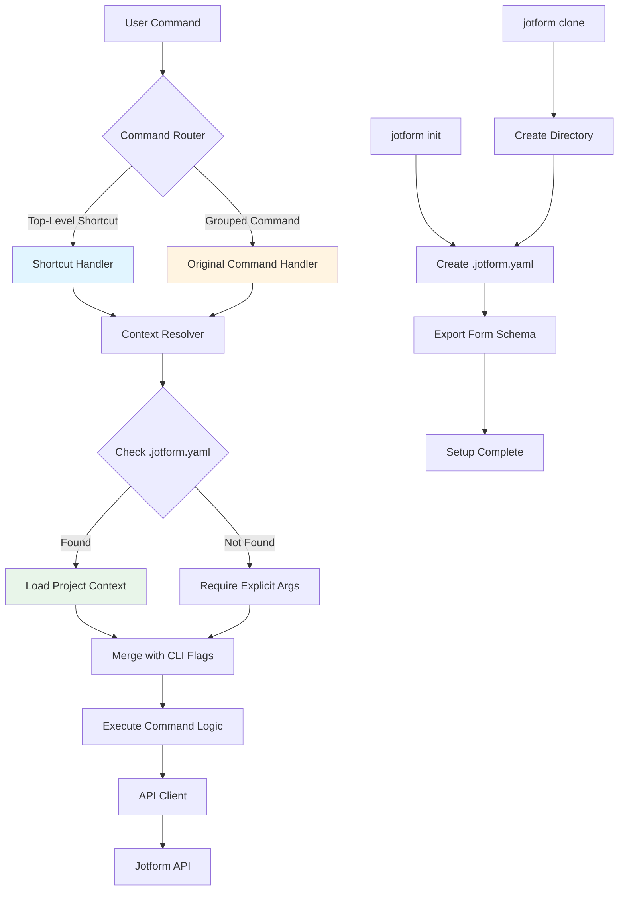
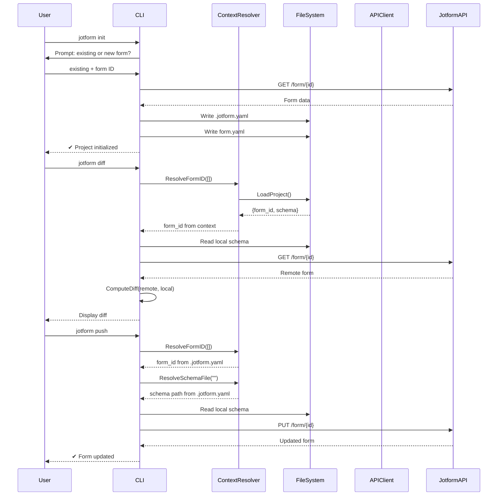

# Design Document: Jotform CLI DX Redesign

## Overview

The Jotform CLI DX Redesign transforms the command-line interface from a verbose, hierarchical structure to a streamlined, developer-friendly experience inspired by modern CLI tools (gh, fly, vercel). The core philosophy is "Her Zaman Daha Az Yazmak" (Always Write Less) — daily operations should never exceed 2 words. This redesign introduces top-level shortcuts, project context awareness via `.jotform.yaml`, and enhanced workflow commands while maintaining full backward compatibility with existing grouped commands.

## Architecture



## Main Workflow Sequence




## Components and Interfaces

### Component 1: Command Router

**Purpose**: Routes incoming commands to either shortcut handlers or original grouped command handlers

**Interface**:
```go
// Cobra command structure - shortcuts delegate to original RunE functions
type Command struct {
    Use     string
    Aliases []string
    Short   string
    RunE    func(cmd *cobra.Command, args []string) error
}
```

**Responsibilities**:
- Register top-level shortcuts alongside grouped commands
- Maintain backward compatibility by keeping both command structures
- Copy flags from original commands to shortcuts
- Delegate execution to shared RunE functions

**Implementation Status**: ✅ Implemented in `cmd/shortcuts.go`

### Component 2: Context Resolver

**Purpose**: Resolves form IDs and schema file paths from project context or explicit arguments

**Interface**:
```go
package config

// ResolveFormID determines form ID from args or .jotform.yaml
func ResolveFormID(args []string) (string, error)

// ResolveSchemaFile determines schema path from flag or .jotform.yaml
func ResolveSchemaFile(flagFile string) (string, error)

// LoadProject searches for .jotform.yaml in current and parent directories
func LoadProject() (*ProjectConfig, error)

// SaveProject writes .jotform.yaml to specified directory
func SaveProject(cfg *ProjectConfig, dir string) error
```

**Responsibilities**:
- Search for `.jotform.yaml` in current directory and walk up parent directories
- Parse YAML configuration file
- Provide fallback to explicit arguments when no project context exists
- Return helpful error messages guiding users to run `jotform init`

**Implementation Status**: ✅ Implemented in `internal/config/context.go`

### Component 3: Project Initializer

**Purpose**: Creates `.jotform.yaml` project files through interactive or flag-based workflows

**Interface**:
```go
// InitCommand creates project context
type InitCommand struct {
    Interactive bool
    FormID      string
    SchemaFile  string
    NewForm     bool
}

func (c *InitCommand) Execute() error

// CloneCommand creates new directory with project context
type CloneCommand struct {
    FormID     string
    TargetDir  string
    UseTitle   bool  // Use form title as directory name
}

func (c *CloneCommand) Execute() error
```

**Responsibilities**:
- Prompt user for form ID or new form creation
- Export form schema to local file
- Create `.jotform.yaml` with form metadata
- Provide clear success messages with next steps

**Implementation Status**: ❌ Not yet implemented

### Component 4: Status Reporter

**Purpose**: Displays git-like status comparing local and remote form state

**Interface**:
```go
type StatusCommand struct {
    FormID     string
    SchemaFile string
}

type StatusReport struct {
    FormID         string
    FormName       string
    LocalModified  time.Time
    RemoteModified time.Time
    Changes        []Change
}

type Change struct {
    Type  ChangeType  // Added, Modified, Deleted
    Path  string      // JSON path to changed field
    Old   interface{}
    New   interface{}
}

func (c *StatusCommand) Execute() (*StatusReport, error)
func (r *StatusReport) Display() string
```

**Responsibilities**:
- Load local schema file
- Fetch remote form
- Compute structural diff
- Display human-readable change summary
- Suggest next actions (push/pull)

**Implementation Status**: ❌ Not yet implemented

### Component 5: Browser Opener

**Purpose**: Opens forms in default browser for quick visual inspection

**Interface**:
```go
type OpenCommand struct {
    FormID string
}

func (c *OpenCommand) Execute() error
func openBrowser(url string) error
```

**Responsibilities**:
- Resolve form ID from context or argument
- Construct Jotform form URL
- Open URL in system default browser
- Handle cross-platform browser launching (macOS, Linux, Windows)

**Implementation Status**: ❌ Not yet implemented

### Component 6: Shell Completion Generator

**Purpose**: Provides shell completion for commands, flags, and dynamic values

**Interface**:
```go
// Cobra built-in completion support
func init() {
    rootCmd.AddCommand(completionCmd)
}

// Dynamic completion for form IDs
func formIDCompletion(cmd *cobra.Command, args []string, toComplete string) ([]string, cobra.ShellCompDirective)
```

**Responsibilities**:
- Generate completion scripts for bash, zsh, fish, powershell
- Provide static completion for commands and flags
- Optionally provide dynamic completion for form IDs from API
- Install completion scripts to appropriate shell config locations

**Implementation Status**: ❌ Not yet implemented


## Data Models

### Model 1: ProjectConfig

```go
// ProjectConfig represents .jotform.yaml file structure
type ProjectConfig struct {
    FormID string `yaml:"form_id"`  // Jotform form ID
    Name   string `yaml:"name"`     // Human-readable form name
    Schema string `yaml:"schema"`   // Relative path to local schema file
}
```

**Validation Rules**:
- `form_id` must be non-empty string matching Jotform ID format (numeric)
- `name` is optional but recommended for readability
- `schema` must be relative path to existing file (validated on load)
- Schema path is resolved relative to `.jotform.yaml` location

**File Format Example**:
```yaml
# Jotform CLI project configuration
# See: https://github.com/jotform/jotform-cli

form_id: "242753193847060"
name: "Contact Form"
schema: form.yaml
```

**Implementation Status**: ✅ Implemented in `internal/config/context.go`

### Model 2: StatusReport

```go
type StatusReport struct {
    FormID         string
    FormName       string
    LocalPath      string
    LocalModified  time.Time
    RemoteModified time.Time
    Changes        []Change
    HasChanges     bool
}

type Change struct {
    Type        ChangeType  // Added, Modified, Deleted
    Path        string      // JSON path (e.g., "questions.3.text")
    Description string      // Human-readable change description
    OldValue    interface{} // Previous value (for Modified/Deleted)
    NewValue    interface{} // New value (for Added/Modified)
}

type ChangeType int

const (
    ChangeAdded ChangeType = iota
    ChangeModified
    ChangeDeleted
)
```

**Validation Rules**:
- `FormID` must be valid Jotform form ID
- `Changes` slice is empty when `HasChanges` is false
- `Path` uses dot notation for nested fields
- Timestamps use RFC3339 format for consistency

**Implementation Status**: ❌ Not yet implemented

### Model 3: InitOptions

```go
type InitOptions struct {
    Mode       InitMode  // Existing or New
    FormID     string    // Required for Existing mode
    SchemaFile string    // Output schema file path
    FormTitle  string    // Required for New mode
    Interactive bool     // Enable interactive prompts
}

type InitMode int

const (
    InitExisting InitMode = iota
    InitNew
)
```

**Validation Rules**:
- When `Mode` is `InitExisting`, `FormID` must be provided
- When `Mode` is `InitNew`, `FormTitle` must be provided
- `SchemaFile` defaults to "form.yaml" if not specified
- `Interactive` mode validates inputs through prompts

**Implementation Status**: ❌ Not yet implemented


## Algorithmic Pseudocode

### Algorithm 1: Project Initialization (jotform init)

```pascal
ALGORITHM initializeProject(options)
INPUT: options of type InitOptions
OUTPUT: success boolean

BEGIN
  // Step 1: Determine initialization mode
  IF options.Interactive THEN
    mode ← promptUser("Link to existing form or create new? [existing/new]")
    IF mode = "existing" THEN
      formID ← promptUser("Form ID:")
      ASSERT formID matches pattern "^\d+$"
    ELSE
      formTitle ← promptUser("Form title:")
      formID ← createNewForm(formTitle)
    END IF
    schemaFile ← promptUser("Local schema file:", default="form.yaml")
  ELSE
    ASSERT options.FormID ≠ "" OR options.FormTitle ≠ ""
    formID ← options.FormID
    schemaFile ← options.SchemaFile OR "form.yaml"
  END IF
  
  // Step 2: Fetch form data from API
  client ← newAPIClient()
  form ← client.GetForm(formID)
  ASSERT form ≠ null
  
  // Step 3: Export form schema to local file
  schema ← formToSchema(form)
  writeFile(schemaFile, schema)
  
  // Step 4: Create .jotform.yaml configuration
  config ← ProjectConfig{
    FormID: formID,
    Name: form.Title,
    Schema: schemaFile
  }
  writeFile(".jotform.yaml", serializeYAML(config))
  
  // Step 5: Display success message
  PRINT "✔ Exported form → " + schemaFile
  PRINT "✔ Created .jotform.yaml"
  PRINT ""
  PRINT "Now you can use:"
  PRINT "  jotform diff     compare local vs remote"
  PRINT "  jotform push     apply local changes"
  PRINT "  jotform pull     download latest remote"
  PRINT "  jotform watch    stream submissions"
  
  RETURN true
END
```

**Preconditions**:
- User has valid Jotform API credentials
- For existing forms: form ID must exist and be accessible
- Current directory is writable

**Postconditions**:
- `.jotform.yaml` file exists in current directory
- Schema file exists at specified path
- Schema file contains valid form structure
- User can execute context-aware commands

**Loop Invariants**: N/A (no loops in main flow)

### Algorithm 2: Context Resolution

```pascal
ALGORITHM resolveFormID(args)
INPUT: args array of strings (command-line arguments)
OUTPUT: formID string

BEGIN
  // Priority 1: Explicit argument
  IF length(args) > 0 AND args[0] ≠ "" THEN
    RETURN args[0]
  END IF
  
  // Priority 2: Project context
  projectConfig ← loadProjectConfig()
  IF projectConfig ≠ null AND projectConfig.FormID ≠ "" THEN
    RETURN projectConfig.FormID
  END IF
  
  // No form ID available
  THROW Error("form ID required — pass as argument or run 'jotform init'")
END

ALGORITHM loadProjectConfig()
OUTPUT: config of type ProjectConfig or null

BEGIN
  currentDir ← getCurrentDirectory()
  
  // Walk up directory tree
  WHILE currentDir ≠ rootDirectory DO
    configPath ← join(currentDir, ".jotform.yaml")
    
    IF fileExists(configPath) THEN
      data ← readFile(configPath)
      config ← parseYAML(data)
      
      // Resolve relative schema path
      IF config.Schema ≠ "" AND NOT isAbsolutePath(config.Schema) THEN
        config.Schema ← join(currentDir, config.Schema)
      END IF
      
      RETURN config
    END IF
    
    currentDir ← parentDirectory(currentDir)
  END WHILE
  
  RETURN null
END
```

**Preconditions**:
- File system is accessible
- Current working directory can be determined

**Postconditions**:
- Returns valid form ID string or throws descriptive error
- For project context: `.jotform.yaml` is found and parsed successfully
- Schema path is resolved to absolute path

**Loop Invariants**:
- `currentDir` moves up one level each iteration
- Loop terminates when root directory is reached or config is found

### Algorithm 3: Status Computation

```pascal
ALGORITHM computeStatus(formID, schemaFile)
INPUT: formID string, schemaFile string
OUTPUT: report of type StatusReport

BEGIN
  // Step 1: Load local schema
  localSchema ← readFile(schemaFile)
  localModified ← getFileModificationTime(schemaFile)
  
  // Step 2: Fetch remote form
  client ← newAPIClient()
  remoteForm ← client.GetForm(formID)
  remoteSchema ← formToSchema(remoteForm)
  remoteModified ← remoteForm.UpdatedAt
  
  // Step 3: Compute structural diff
  changes ← EMPTY_ARRAY
  
  // Compare questions
  FOR each questionID IN union(localSchema.questions, remoteSchema.questions) DO
    localQ ← localSchema.questions[questionID]
    remoteQ ← remoteSchema.questions[questionID]
    
    IF localQ = null AND remoteQ ≠ null THEN
      changes.append(Change{
        Type: ChangeDeleted,
        Path: "questions." + questionID,
        Description: "Deleted: " + remoteQ.text,
        OldValue: remoteQ
      })
    ELSE IF localQ ≠ null AND remoteQ = null THEN
      changes.append(Change{
        Type: ChangeAdded,
        Path: "questions." + questionID,
        Description: "Added: " + localQ.text,
        NewValue: localQ
      })
    ELSE IF localQ ≠ remoteQ THEN
      fieldChanges ← compareObjects(localQ, remoteQ)
      FOR each fieldChange IN fieldChanges DO
        changes.append(fieldChange)
      END FOR
    END IF
  END FOR
  
  // Step 4: Build status report
  report ← StatusReport{
    FormID: formID,
    FormName: remoteForm.Title,
    LocalPath: schemaFile,
    LocalModified: localModified,
    RemoteModified: remoteModified,
    Changes: changes,
    HasChanges: length(changes) > 0
  }
  
  RETURN report
END
```

**Preconditions**:
- `formID` is valid and accessible via API
- `schemaFile` exists and contains valid YAML/JSON
- API client is authenticated

**Postconditions**:
- Returns complete status report with all changes
- Changes are categorized as Added, Modified, or Deleted
- Report includes timestamps for both local and remote versions

**Loop Invariants**:
- All processed questions have been compared and changes recorded
- `changes` array contains only valid Change objects


## Key Functions with Formal Specifications

### Function 1: ResolveFormID

```go
func ResolveFormID(args []string) (string, error)
```

**Preconditions**:
- `args` is a valid slice (may be empty)
- File system is accessible for reading `.jotform.yaml`
- Current working directory can be determined

**Postconditions**:
- Returns non-empty form ID string when successful
- Returns error with helpful message when form ID cannot be determined
- Error message guides user to provide argument or run `jotform init`
- No side effects on file system or global state

**Loop Invariants**: N/A (directory traversal handled by LoadProject)

### Function 2: LoadProject

```go
func LoadProject() (*ProjectConfig, error)
```

**Preconditions**:
- File system is readable
- Current working directory exists and is accessible

**Postconditions**:
- Returns `nil, nil` when no `.jotform.yaml` found (not an error condition)
- Returns `*ProjectConfig, nil` when valid config found
- Returns `nil, error` when config file is malformed
- Schema path in returned config is absolute path
- Searches current directory and all parent directories up to root

**Loop Invariants**:
- Directory traversal moves up exactly one level per iteration
- Loop terminates at root directory or when config file found
- No infinite loops (guaranteed by filesystem structure)

### Function 3: SaveProject

```go
func SaveProject(cfg *ProjectConfig, dir string) error
```

**Preconditions**:
- `cfg` is non-nil with valid FormID
- `dir` is valid directory path (created if doesn't exist)
- Process has write permissions for target directory

**Postconditions**:
- `.jotform.yaml` file exists at `dir/.jotform.yaml`
- File contains valid YAML with header comments
- File is readable by LoadProject function
- Returns error if write fails, nil on success
- Directory is created if it doesn't exist

**Loop Invariants**: N/A (no loops)

### Function 4: runInit

```go
func runInit(cmd *cobra.Command, args []string) error
```

**Preconditions**:
- User is authenticated (has valid API key)
- Current directory is writable
- For existing form mode: form ID is valid and accessible

**Postconditions**:
- `.jotform.yaml` exists in current directory
- Schema file exists at specified path
- Schema file contains valid form structure from API
- Returns nil on success, error with descriptive message on failure
- No partial state (either both files created or neither)

**Loop Invariants**: N/A (sequential operations with error handling)

### Function 5: runStatus

```go
func runStatus(cmd *cobra.Command, args []string) error
```

**Preconditions**:
- Form ID can be resolved (from args or context)
- Schema file can be resolved (from flag or context)
- User is authenticated with API access
- Schema file exists and is readable

**Postconditions**:
- Displays formatted status report to stdout
- Shows all structural differences between local and remote
- Suggests next actions (push/pull) when changes detected
- Returns nil on success, error if API call or file read fails
- No modifications to local or remote state

**Loop Invariants**:
- All questions in both local and remote schemas are compared
- Each detected change is included exactly once in output

### Function 6: runOpen

```go
func runOpen(cmd *cobra.Command, args []string) error
```

**Preconditions**:
- Form ID can be resolved (from args or context)
- System has default browser configured
- Process has permission to launch external programs

**Postconditions**:
- Browser opens with Jotform form URL
- Returns nil on successful browser launch
- Returns error if form ID invalid or browser launch fails
- No modifications to form or local state
- Works cross-platform (macOS, Linux, Windows)

**Loop Invariants**: N/A (single operation)

### Function 7: runClone

```go
func runClone(cmd *cobra.Command, args []string) error
```

**Preconditions**:
- `args[0]` contains valid form ID
- User is authenticated with API access
- Current directory is writable
- Target directory doesn't exist (or --force flag provided)

**Postconditions**:
- New directory created with slugified form title as name
- Directory contains `.jotform.yaml` and schema file
- Both files are valid and loadable
- Returns nil on success, error on failure
- No partial state (directory created only if all operations succeed)

**Loop Invariants**: N/A (sequential operations with rollback on error)


## Example Usage

### Example 1: Initialize existing form project

```bash
# Interactive mode
$ jotform init
? Link to existing form or create new? [existing/new]: existing
? Form ID: 242753193847060
? Local schema file: form.yaml
✔ Exported form → form.yaml
✔ Created .jotform.yaml

Now you can use:
  jotform diff     compare local vs remote
  jotform push     apply local changes
  jotform pull     download latest remote
  jotform watch    stream submissions

# Non-interactive mode with flags
$ jotform init --existing --form-id 242753193847060 --schema form.yaml
✔ Exported form → form.yaml
✔ Created .jotform.yaml
```

### Example 2: Clone form to new directory

```bash
$ jotform clone 242753193847060
Creating directory: contact-form/
✔ Exported form → contact-form/form.yaml
✔ Created contact-form/.jotform.yaml

$ cd contact-form
$ jotform status
Form: Contact Form (242753193847060)
Local schema: form.yaml (just created)
Remote: last updated 5 hours ago
No changes detected.
```

### Example 3: Context-aware workflow

```bash
# Without project context (old way)
$ jotform forms diff 242753193847060 --file form.yaml
$ jotform forms apply 242753193847060 --file form.yaml

# With project context (new way)
$ cd my-form-project
$ jotform diff      # form ID and schema from .jotform.yaml
$ jotform push      # applies changes automatically
```

### Example 4: Status command

```bash
$ jotform status
Form: Contact Form (242753193847060)
Local schema: form.yaml (modified 2 hours ago)
Remote: last updated 5 hours ago

Changes:
  ~ questions.3.text: "Phone" → "Mobile Phone"
  + questions.5: new dropdown field "Department"
  - questions.7: removed field "Fax Number"

Run 'jotform push' to apply local changes.
Run 'jotform pull' to overwrite with remote.
```

### Example 5: Open form in browser

```bash
$ jotform open              # Uses form ID from .jotform.yaml
Opening https://form.jotform.com/242753193847060

$ jotform open 123456789    # Explicit form ID
Opening https://form.jotform.com/123456789
```

### Example 6: Shortcut commands comparison

```bash
# Old verbose commands (still work)
$ jotform auth login
$ jotform forms list
$ jotform forms get 242753193847060
$ jotform forms export 242753193847060 --out form.yaml
$ jotform forms apply 242753193847060 --file form.yaml
$ jotform submissions watch 242753193847060
$ jotform ai generate-schema "Contact form with name and email"

# New shortcuts (preferred)
$ jotform login
$ jotform ls
$ jotform get 242753193847060
$ jotform pull 242753193847060 --out form.yaml
$ jotform push 242753193847060 --file form.yaml
$ jotform watch 242753193847060
$ jotform generate "Contact form with name and email"

# With project context (shortest)
$ jotform pull
$ jotform push
$ jotform watch
$ jotform diff
```

### Example 7: Shell completion

```bash
# Install completion for current shell
$ jotform completion bash > /etc/bash_completion.d/jotform
$ jotform completion zsh > ~/.zsh/completion/_jotform

# Use completion
$ jotform pu<TAB>
pull  push

$ jotform diff --<TAB>
--file  --dry-run  --help

# Dynamic form ID completion (if implemented)
$ jotform get <TAB>
242753193847060  242753193847061  242753193847062
```


## Correctness Properties

*A property is a characteristic or behavior that should hold true across all valid executions of a system—essentially, a formal statement about what the system should do. Properties serve as the bridge between human-readable specifications and machine-verifiable correctness guarantees.*

### Property 1: Context Resolution Determinism

For any given directory state and arguments, ResolveFormID returns consistent results across multiple invocations.

**Validates: Requirements 2.2, 2.3, 9.3**

### Property 2: Project File Roundtrip

For any project configuration, saving then loading preserves all form metadata (form ID, name, and schema path).

**Validates: Requirements 3.6, 13.2, 13.3, 13.4**

### Property 3: Backward Compatibility

For any grouped command with any arguments, the command executes with identical behavior to previous versions.

**Validates: Requirements 8.1, 8.2**

### Property 4: Shortcut Equivalence

For any shortcut command with any arguments, the shortcut produces identical results to its grouped counterpart.

**Validates: Requirement 1.1, 1.2, 1.3, 1.4, 1.5, 1.6, 1.7, 1.8, 1.9, 1.10, 1.11, 1.12**

### Property 5: Explicit Arguments Override Context

For any form ID argument and any project context with a different form ID, ResolveFormID returns the explicit argument.

**Validates: Requirements 2.5, 9.1, 9.2**

### Property 6: Directory Traversal Termination

For any starting directory, LoadProject terminates in finite time (no infinite loops).

**Validates: Requirement 2.4**

### Property 7: Status Idempotence

For any form ID and schema file, running status multiple times produces identical results with no side effects.

**Validates: Requirements 5.1, 5.2, 5.3**

### Property 8: Init Atomicity

For any initialization options, init either creates both `.jotform.yaml` and schema file, or creates neither (no partial state).

**Validates: Requirements 3.6, 3.7**

### Property 9: Schema Path Resolution

For any project configuration, loaded schema paths are always absolute paths (relative paths are converted).

**Validates: Requirement 11.7**

### Property 10: Error Messages Provide Guidance

For any error condition, error messages contain actionable guidance directing users toward resolution.

**Validates: Requirements 10.1, 10.2, 10.3, 10.4, 10.5, 10.6, 10.7, 10.8**

### Property 11: Slugify Produces Filesystem-Safe Names

For any form title, slugification produces a lowercase, hyphenated string with no special characters and maximum length of 50 characters.

**Validates: Requirements 11.1, 11.2, 11.3, 11.4**

### Property 12: Slugify Idempotence

For any string, slugifying an already-slugified string returns the same result.

**Validates: Requirements 4.2, 11.1, 11.2, 11.3**

### Property 13: Clone Creates Complete Project

For any form ID, successful clone creates a directory containing both `.jotform.yaml` and schema file.

**Validates: Requirements 4.1, 4.4, 4.5**

### Property 14: Path Validation Rejects Unsafe Paths

For any schema path containing absolute paths or parent directory references (`..`), validation rejects the path.

**Validates: Requirements 11.5, 11.6**

### Property 15: Dry-Run Makes No Modifications

For any command with `--dry-run` flag, no API calls that modify data are made and no local files are changed.

**Validates: Requirement 12.7**

### Property 16: Success Commands Return Zero

For any command that completes successfully, the exit code is 0.

**Validates: Requirement 8.5**

### Property 17: Failed Commands Return Non-Zero

For any command that fails, the exit code is non-zero.

**Validates: Requirement 8.6**

### Property 18: Status Shows All Changes

For any local and remote schema with differences, status displays all changes with correct type indicators (added, modified, deleted).

**Validates: Requirements 5.4, 5.5, 5.6**

### Property 19: URL Construction Correctness

For any form ID, the constructed Jotform URL follows the format `https://form.jotform.com/{form_id}`.

**Validates: Requirement 6.3**

### Property 20: File Permissions Are Restrictive

For any file created by the CLI (`.jotform.yaml` or schema files), the file permissions are set to 0644.

**Validates: Requirement 11.8**

### Property 21: Form ID Validation

For any form ID loaded from `.jotform.yaml`, the form ID is non-empty and matches numeric format.

**Validates: Requirements 13.5, 13.6**

### Property 22: Clone Directory Collision Handling

For any form title where the slugified directory name already exists, clone appends a numeric suffix to create a unique name.

**Validates: Requirement 4.7**

### Property 23: Context Fallback Behavior

For any command requiring a form ID, when no explicit argument is provided and project context exists, the context form ID is used.

**Validates: Requirements 2.2, 9.3**

### Property 24: Shell Completion Includes All Commands

For any shell completion request, all command names are included in the completion results.

**Validates: Requirement 7.5**

### Property 25: Shell Completion Includes All Flags

For any shell completion request for a specific command, all flag names for that command are included in the completion results.

**Validates: Requirement 7.6**

### Property 26: JSON Output Structure Stability

For any command producing JSON output, the output structure matches the expected schema from previous versions.

**Validates: Requirement 8.3**

### Property 27: Cross-Platform Path Handling

For any file path operation, the CLI uses platform-appropriate path separators and conventions.

**Validates: Requirements 15.4, 15.5**

### Property 28: Prompt Input Validation

For any interactive prompt requiring form ID input, non-numeric inputs are rejected and the user is re-prompted.

**Validates: Requirement 14.2**

### Property 29: Force Flag Bypasses Confirmation

For any destructive operation with `--force` flag, no confirmation prompt is displayed.

**Validates: Requirement 12.5**

### Property 30: Name Flag Overrides Slugified Title

For any clone operation with `--name` flag, the specified name is used instead of the slugified form title.

**Validates: Requirement 4.6**


## Error Handling

### Error Scenario 1: No Form ID Available

**Condition**: User runs context-aware command without project context and without explicit form ID argument

**Response**: 
```
Error: form ID required — pass as argument or run 'jotform init' to set up project context
```

**Recovery**: 
- User provides form ID as argument: `jotform diff 242753193847060`
- User initializes project: `jotform init` then `jotform diff`

### Error Scenario 2: Invalid .jotform.yaml Format

**Condition**: `.jotform.yaml` exists but contains malformed YAML or missing required fields

**Response**:
```
Error: invalid /path/to/.jotform.yaml: yaml: unmarshal error
```

**Recovery**:
- User manually fixes YAML syntax
- User deletes file and runs `jotform init` again
- User provides explicit arguments to bypass context

### Error Scenario 3: Schema File Not Found

**Condition**: `.jotform.yaml` references schema file that doesn't exist

**Response**:
```
Error: schema file not found: form.yaml (referenced in .jotform.yaml)
Run 'jotform pull' to download the form schema.
```

**Recovery**:
- User runs `jotform pull` to re-download schema
- User updates `.jotform.yaml` to point to correct file
- User provides explicit `--file` flag

### Error Scenario 4: Form ID Not Found on API

**Condition**: Form ID from context or argument doesn't exist or user lacks access

**Response**:
```
Error: form not found: 242753193847060
Verify the form ID and ensure you have access to this form.
```

**Recovery**:
- User verifies form ID is correct
- User checks API key has access to form
- User updates `.jotform.yaml` with correct form ID

### Error Scenario 5: Directory Not Writable

**Condition**: User runs `jotform init` or `jotform clone` in directory without write permissions

**Response**:
```
Error: cannot write to current directory: permission denied
Ensure you have write permissions or choose a different directory.
```

**Recovery**:
- User changes to writable directory
- User adjusts directory permissions
- User runs with appropriate privileges

### Error Scenario 6: Target Directory Already Exists

**Condition**: User runs `jotform clone` but target directory already exists

**Response**:
```
Error: directory already exists: contact-form/
Use --force to overwrite or choose a different name.
```

**Recovery**:
- User removes existing directory
- User runs with `--force` flag to overwrite
- User renames existing directory

### Error Scenario 7: Browser Launch Failure

**Condition**: `jotform open` cannot launch system browser

**Response**:
```
Error: failed to open browser: exec: "xdg-open": executable file not found
Form URL: https://form.jotform.com/242753193847060
```

**Recovery**:
- User manually copies URL and opens in browser
- User installs required system utilities (xdg-open, open, etc.)
- URL is always displayed even when browser launch fails

### Error Scenario 8: Conflicting Flags and Context

**Condition**: User provides both explicit arguments and has project context (not an error, but needs clear precedence)

**Response**: No error - explicit arguments take precedence silently

**Recovery**: N/A - this is expected behavior

**Logging**: Optional verbose mode can show: `Using form ID from argument (overriding .jotform.yaml)`


## Testing Strategy

### Unit Testing Approach

**Context Resolution Tests**:
- Test `ResolveFormID` with explicit arguments
- Test `ResolveFormID` with project context
- Test `ResolveFormID` with no context (error case)
- Test `ResolveSchemaFile` with flag override
- Test `ResolveSchemaFile` with project context
- Test priority: explicit args > project context

**Project Loading Tests**:
- Test `LoadProject` in directory with `.jotform.yaml`
- Test `LoadProject` in subdirectory (walks up to find config)
- Test `LoadProject` with no config file (returns nil, nil)
- Test `LoadProject` with malformed YAML (returns error)
- Test schema path resolution (relative → absolute)

**Project Saving Tests**:
- Test `SaveProject` creates valid YAML file
- Test `SaveProject` creates directory if needed
- Test `SaveProject` with various ProjectConfig values
- Test roundtrip: save then load preserves data

**Slugify Tests**:
- Test `Slugify` with normal titles: "Contact Form" → "contact-form"
- Test `Slugify` with special characters: "User's Survey!" → "users-survey"
- Test `Slugify` with long titles (truncation)
- Test `Slugify` with empty/whitespace-only input

**Coverage Goals**: 90%+ for config package, 80%+ for command handlers

### Property-Based Testing Approach

**Property Test Library**: Use `gopter` (Go property testing library)

**Property 1: Context Resolution Determinism**
```go
// Generate random args and directory states
// Verify ResolveFormID returns same result on repeated calls
properties.Property("ResolveFormID is deterministic", prop.ForAll(
    func(args []string) bool {
        result1, err1 := ResolveFormID(args)
        result2, err2 := ResolveFormID(args)
        return result1 == result2 && reflect.DeepEqual(err1, err2)
    },
    gen.SliceOf(gen.Identifier()),
))
```

**Property 2: Project Config Roundtrip**
```go
// Generate random ProjectConfig
// Verify save → load preserves all fields
properties.Property("ProjectConfig roundtrip preserves data", prop.ForAll(
    func(formID, name, schema string) bool {
        cfg := &ProjectConfig{FormID: formID, Name: name, Schema: schema}
        dir := createTempDir()
        defer os.RemoveAll(dir)
        
        SaveProject(cfg, dir)
        loaded, _ := LoadProject()
        
        return loaded.FormID == cfg.FormID &&
               loaded.Name == cfg.Name &&
               filepath.Base(loaded.Schema) == filepath.Base(cfg.Schema)
    },
    gen.Identifier(),
    gen.AnyString(),
    gen.Identifier(),
))
```

**Property 3: Slugify Idempotence**
```go
// Slugifying a slug returns the same slug
properties.Property("Slugify is idempotent", prop.ForAll(
    func(title string) bool {
        slug1 := Slugify(title)
        slug2 := Slugify(slug1)
        return slug1 == slug2
    },
    gen.AnyString(),
))
```

**Property 4: Slugify Safety**
```go
// Slugified strings are always filesystem-safe
properties.Property("Slugify produces filesystem-safe names", prop.ForAll(
    func(title string) bool {
        slug := Slugify(title)
        // Check no special characters
        matched, _ := regexp.MatchString("^[a-z0-9-]*$", slug)
        return matched && len(slug) <= 50
    },
    gen.AnyString(),
))
```

### Integration Testing Approach

**End-to-End Workflow Tests**:
1. **Init → Diff → Push Workflow**
   - Create temp directory
   - Run `jotform init` with test form ID
   - Verify `.jotform.yaml` and schema file created
   - Modify schema file
   - Run `jotform diff` and verify output shows changes
   - Run `jotform push --dry-run` and verify no API call
   - Clean up

2. **Clone → Status → Pull Workflow**
   - Run `jotform clone` with test form ID
   - Verify directory created with correct name
   - Change into directory
   - Run `jotform status` and verify output
   - Modify remote form via API
   - Run `jotform pull` and verify local file updated
   - Clean up

3. **Shortcut Equivalence Tests**
   - For each shortcut, run both shortcut and grouped command
   - Verify identical output and behavior
   - Test with and without project context

**Mock API Tests**:
- Use `httptest` to mock Jotform API responses
- Test error handling for API failures
- Test rate limiting and retry logic
- Test authentication failures

**Cross-Platform Tests**:
- Test on Linux, macOS, Windows (CI/CD)
- Test browser opening on each platform
- Test file path handling (forward/backward slashes)
- Test shell completion generation for each shell


## Performance Considerations

### Context Loading Performance

**Challenge**: Walking up directory tree to find `.jotform.yaml` could be slow on deep directory structures

**Optimization Strategy**:
- Cache loaded project config in memory for duration of command execution
- Limit directory traversal to reasonable depth (e.g., 20 levels)
- Use early termination when config found
- Consider caching config location in environment variable for repeated commands

**Expected Performance**: < 5ms for context loading on typical directory depths (< 10 levels)

### API Call Minimization

**Challenge**: Commands like `status` and `diff` require fetching remote form data

**Optimization Strategy**:
- Cache API responses for short duration (configurable, default 30s)
- Use ETags/If-Modified-Since headers when API supports them
- Batch multiple API calls when possible
- Provide `--offline` flag for commands that can work with cached data

**Expected Performance**: Single API call per command execution (no redundant calls)

### Large Form Handling

**Challenge**: Forms with hundreds of questions may have large schema files

**Optimization Strategy**:
- Stream file reading/writing for large schemas
- Use efficient diff algorithms (Myers diff or similar)
- Provide `--summary` flag for abbreviated diff output
- Consider binary format option for very large forms

**Expected Performance**: Handle forms with 500+ questions in < 2s for diff operations

### Shell Completion Performance

**Challenge**: Dynamic completion (e.g., form IDs) requires API calls

**Optimization Strategy**:
- Cache form list locally with TTL (default 5 minutes)
- Provide static completion for commands and flags (no API call)
- Make dynamic completion opt-in via config flag
- Timeout completion API calls after 500ms

**Expected Performance**: Static completion < 50ms, dynamic completion < 500ms or fallback to static


## Security Considerations

### API Key Handling in Project Files

**Threat**: Users might accidentally commit API keys to `.jotform.yaml`

**Mitigation**:
- `.jotform.yaml` NEVER contains API keys (only form metadata)
- API keys remain in system keychain or environment variables
- Documentation clearly warns against committing credentials
- Provide `.gitignore` template that includes sensitive files

### Project File Validation

**Threat**: Malicious `.jotform.yaml` files could cause path traversal attacks

**Mitigation**:
- Validate schema paths don't escape project directory (no `../../../etc/passwd`)
- Sanitize all file paths before reading/writing
- Reject absolute paths in schema field (require relative paths)
- Validate form IDs match expected format (numeric only)

### Command Injection via Form Data

**Threat**: Form titles or field names could contain shell metacharacters

**Mitigation**:
- Never pass form data directly to shell commands
- Use Go's `exec.Command` with separate arguments (not shell string)
- Sanitize form titles when used in file paths (Slugify function)
- Escape special characters in output display

### Dry-Run Flag Enforcement

**Threat**: `--dry-run` flag might not prevent all destructive operations

**Mitigation**:
- Check `--dry-run` flag before ANY API write operation
- Use separate code paths for dry-run vs real execution
- Add unit tests verifying dry-run makes no API calls
- Log all operations that would be performed in dry-run mode

### Browser Opening Security

**Threat**: Malicious form IDs could construct dangerous URLs

**Mitigation**:
- Validate form IDs before constructing URLs
- Use URL encoding for all dynamic URL components
- Whitelist allowed URL schemes (https only)
- Display URL before opening browser (user can verify)

### File Permission Handling

**Threat**: Created files might have overly permissive permissions

**Mitigation**:
- Create `.jotform.yaml` with 0644 permissions (readable by owner and group)
- Create schema files with 0644 permissions
- Never create files with execute permissions
- Respect user's umask settings


## Dependencies

### Existing Dependencies (Already in Project)

- **github.com/spf13/cobra** - CLI framework for command structure and flag parsing
- **github.com/spf13/viper** - Configuration management
- **gopkg.in/yaml.v3** - YAML parsing for `.jotform.yaml` and schema files
- **github.com/jotform/jotform-cli/internal/api** - Jotform API client
- **github.com/jotform/jotform-cli/internal/config** - Context resolution (already implemented)
- **github.com/jotform/jotform-cli/internal/formcode** - Form schema codec and diff

### New Dependencies Required

- **github.com/pkg/browser** - Cross-platform browser opening for `jotform open` command
  - Handles macOS (`open`), Linux (`xdg-open`), Windows (`start`)
  - Lightweight, well-maintained, MIT license

- **github.com/leanovate/gopter** (optional) - Property-based testing library
  - For implementing property tests in test suite
  - Only needed in test dependencies, not runtime

### Standard Library Dependencies

- **os** - File system operations, environment variables
- **path/filepath** - Cross-platform path manipulation
- **time** - Timestamp handling for status reports
- **encoding/json** - JSON parsing for form schemas
- **fmt** - Formatted output
- **bufio** - Interactive prompts for `jotform init`
- **regexp** - Form ID validation, slugify implementation
- **strings** - String manipulation

### Optional Future Dependencies

- **github.com/charmbracelet/bubbletea** - For rich interactive TUI in `jotform init`
  - Would enable arrow key navigation, better prompts
  - Not required for MVP, can use simple stdin prompts

- **github.com/schollz/progressbar** - Progress bars for long operations
  - Useful for `jotform clone` with large forms
  - Not critical for initial release


## Backward Compatibility Strategy

### Principle: Zero Breaking Changes

All existing commands must continue to work exactly as before. The redesign adds new shortcuts and features without removing or changing existing functionality.

### Compatibility Guarantees

**1. Grouped Commands Remain Unchanged**
```bash
# All these continue to work identically
jotform auth login
jotform auth logout
jotform auth whoami
jotform forms list
jotform forms get [id]
jotform forms create --file [path]
jotform forms delete [id]
jotform forms export [id]
jotform forms apply [id]
jotform forms diff [id]
jotform submissions watch [id]
jotform ai generate-schema [prompt]
```

**2. Flag Compatibility**
- All existing flags continue to work with same behavior
- New flags are additive only (no flag removals or renames)
- Flag defaults remain unchanged
- Short flags (-f, -o) maintain same meanings

**3. Output Format Compatibility**
- JSON output structure unchanged (safe for scripts/parsing)
- Table output may have minor formatting improvements
- Exit codes remain consistent (0 = success, non-zero = error)
- Error message formats maintain same structure

**4. Configuration File Compatibility**
- Existing `~/.config/jotform/config.yaml` continues to work
- `.jotform.yaml` is purely additive (doesn't replace existing config)
- Environment variables maintain same precedence
- Keychain storage format unchanged

### Migration Path for Users

**Phase 1: Shortcuts Available (Current Release)**
- Users can start using shortcuts immediately
- No migration required - shortcuts work alongside grouped commands
- Documentation shows both forms with shortcuts marked as "preferred"

**Phase 2: Context Awareness (Next Release)**
- Users can opt-in to project context by running `jotform init`
- Existing workflows without `.jotform.yaml` continue to work
- No forced migration - context is optional convenience feature

**Phase 3: Ecosystem Adoption (Future)**
- Documentation gradually emphasizes shortcuts over grouped commands
- Grouped commands remain supported indefinitely (no deprecation)
- Community tutorials and examples use shortcut syntax

### Testing Backward Compatibility

**Regression Test Suite**:
```go
// Test that grouped commands still work
func TestBackwardCompatibility(t *testing.T) {
    tests := []struct {
        name    string
        command string
        args    []string
    }{
        {"auth login", "auth", []string{"login"}},
        {"forms list", "forms", []string{"list"}},
        {"forms get", "forms", []string{"get", "123"}},
        // ... all existing commands
    }
    
    for _, tt := range tests {
        t.Run(tt.name, func(t *testing.T) {
            // Verify command executes without error
            // Verify output format unchanged
        })
    }
}
```

**Version Compatibility Matrix**:
| Feature | v1.0 (Current) | v1.1 (Shortcuts) | v1.2 (Context) |
|---------|----------------|------------------|----------------|
| Grouped commands | ✅ | ✅ | ✅ |
| Top-level shortcuts | ❌ | ✅ | ✅ |
| Project context | ❌ | ❌ | ✅ |
| Existing scripts | ✅ | ✅ | ✅ |

### Deprecation Policy (Future)

**No Deprecations Planned**: Grouped commands will remain supported indefinitely. This is a pure additive change.

**If Future Deprecation Needed**:
1. Announce deprecation 12 months in advance
2. Show warning messages for deprecated commands
3. Provide automatic migration tool
4. Maintain deprecated commands for minimum 24 months after announcement
5. Document migration path in release notes


## Implementation Roadmap

### Phase 1: Top-Level Shortcuts (✅ COMPLETED)

**Status**: Already implemented in `cmd/shortcuts.go`

**Completed Features**:
- ✅ Auth shortcuts: `login`, `logout`, `whoami`
- ✅ Forms shortcuts: `ls`, `get`, `new`, `rm`
- ✅ Git-like shortcuts: `pull`, `push`, `diff`
- ✅ Submissions shortcut: `watch`
- ✅ AI shortcut: `generate`
- ✅ Flag copying from original commands
- ✅ Backward compatibility maintained

**Verification**:
```bash
jotform login          # Works
jotform ls             # Works
jotform pull [id]      # Works
jotform generate "..."  # Works
```

### Phase 2: Project Context System (🔄 IN PROGRESS)

**Status**: Partially implemented in `internal/config/context.go`

**Completed**:
- ✅ `ProjectConfig` data model
- ✅ `LoadProject()` with directory traversal
- ✅ `SaveProject()` with YAML serialization
- ✅ `ResolveFormID()` with context fallback
- ✅ `ResolveSchemaFile()` with context fallback
- ✅ `Slugify()` utility function

**Remaining Work**:
- ❌ `jotform init` command implementation
- ❌ `jotform clone` command implementation
- ❌ Interactive prompts for init
- ❌ Integration with existing commands

**Estimated Effort**: 2-3 days

### Phase 3: Status and Open Commands (📋 PLANNED)

**New Commands to Implement**:
- ❌ `jotform status` - Show local vs remote diff summary
- ❌ `jotform open` - Open form in browser

**Required Components**:
- Status report data model
- Change detection algorithm
- Formatted status output
- Browser launcher (cross-platform)

**Estimated Effort**: 2-3 days

### Phase 4: Shell Completion (📋 PLANNED)

**Features**:
- ❌ Cobra completion command setup
- ❌ Static completion for commands and flags
- ❌ Optional dynamic completion for form IDs
- ❌ Installation instructions for bash/zsh/fish

**Estimated Effort**: 1-2 days

### Phase 5: Documentation and Polish (📋 PLANNED)

**Tasks**:
- ❌ Update README with shortcut examples
- ❌ Create migration guide
- ❌ Add `.jotform.yaml` to `.gitignore` template
- ❌ Write tutorial for project-based workflow
- ❌ Record demo video/GIF

**Estimated Effort**: 2-3 days

### Total Estimated Timeline

- Phase 1: ✅ Complete
- Phase 2: 2-3 days
- Phase 3: 2-3 days
- Phase 4: 1-2 days
- Phase 5: 2-3 days

**Total**: 7-11 days for complete implementation


## Open Questions and Decisions

### Question 1: Interactive vs Flag-Based Init

**Question**: Should `jotform init` be interactive by default or require flags?

**Options**:
- **A. Interactive by default** (like `git init`, `npm init`)
  - Pros: More user-friendly, guides users through setup
  - Cons: Harder to script, requires stdin
  
- **B. Flag-based by default** (like `terraform init`)
  - Pros: Scriptable, CI/CD friendly
  - Cons: Less discoverable, more typing

- **C. Hybrid approach** (interactive if no flags, flag-based if flags provided)
  - Pros: Best of both worlds
  - Cons: More complex implementation

**Recommendation**: **Option C (Hybrid)** - Interactive when run without flags, flag-based when flags provided. This matches modern CLI patterns (e.g., `gh repo create`).

**Implementation**:
```go
func runInit(cmd *cobra.Command, args []string) error {
    // If flags provided, use non-interactive mode
    if cmd.Flags().Changed("form-id") || cmd.Flags().Changed("new") {
        return runInitNonInteractive(cmd, args)
    }
    // Otherwise, use interactive prompts
    return runInitInteractive(cmd, args)
}
```

### Question 2: Clone Directory Naming

**Question**: When running `jotform clone [id]`, what should the directory name be?

**Options**:
- **A. Form title (slugified)**: `jotform clone 123` → `contact-form/`
  - Pros: Human-readable, meaningful names
  - Cons: Potential collisions, special character handling
  
- **B. Form ID**: `jotform clone 123` → `123/`
  - Pros: Guaranteed unique, simple
  - Cons: Not human-readable
  
- **C. Combination**: `jotform clone 123` → `contact-form-123/`
  - Pros: Both readable and unique
  - Cons: Longer names

- **D. Configurable with flag**: `jotform clone 123 --name my-form`
  - Pros: User control
  - Cons: Extra typing

**Recommendation**: **Option A (slugified title) with Option D (flag override)**. Default to slugified title for readability, but allow `--name` flag for custom names. If title collision exists, append number: `contact-form-2/`.

**Implementation**:
```go
func determineCloneDir(formTitle, formID string, nameFlag string) string {
    if nameFlag != "" {
        return nameFlag
    }
    
    baseDir := Slugify(formTitle)
    if !dirExists(baseDir) {
        return baseDir
    }
    
    // Handle collisions
    for i := 2; i < 100; i++ {
        dir := fmt.Sprintf("%s-%d", baseDir, i)
        if !dirExists(dir) {
            return dir
        }
    }
    
    // Fallback to form ID
    return formID
}
```

### Question 3: Destructive Operation Confirmation

**Question**: Should destructive operations (`rm`, `push`) require confirmation prompts?

**Options**:
- **A. Always prompt** (like `rm -i`)
  - Pros: Prevents accidents
  - Cons: Annoying for experienced users, breaks scripts
  
- **B. Never prompt** (like `rm`)
  - Pros: Fast, scriptable
  - Cons: Easy to make mistakes
  
- **C. Prompt by default, skip with --force** (like `git branch -D`)
  - Pros: Safe by default, scriptable with flag
  - Cons: Extra flag needed for scripts

- **D. Only --dry-run, no prompts** (like `terraform apply`)
  - Pros: Explicit preview step, no interruptions
  - Cons: Requires two-step workflow

**Recommendation**: **Option C (prompt by default, --force to skip)**. This is already implemented for `jotform rm` and should be consistent across all destructive operations.

**Current Implementation** (already in codebase):
```go
// forms delete already has this pattern
force, _ := cmd.Flags().GetBool("force")
if !force {
    if !confirmPrompt(fmt.Sprintf("Delete form %s?", formID)) {
        return nil
    }
}
```

**Apply to**: `jotform push` should also prompt when applying changes (unless `--force` or `--dry-run`).

### Question 4: Status Command Verbosity

**Question**: How detailed should `jotform status` output be?

**Options**:
- **A. Summary only**: Just counts (3 modified, 1 added, 1 deleted)
- **B. Field-level details**: Show each changed field with old/new values
- **C. Configurable**: Summary by default, `--verbose` for details

**Recommendation**: **Option C (configurable)**. Default to field-level details (like `git status`), but provide `--summary` flag for just counts.

**Example Output**:
```bash
# Default (detailed)
$ jotform status
Changes:
  ~ questions.3.text: "Phone" → "Mobile Phone"
  + questions.5: new dropdown field "Department"
  - questions.7: removed field "Fax Number"

# Summary mode
$ jotform status --summary
3 changes: 1 modified, 1 added, 1 deleted
```

### Question 5: Shell Completion Scope

**Question**: Should shell completion include dynamic form ID completion?

**Options**:
- **A. Static only**: Complete commands and flags, no API calls
  - Pros: Fast, works offline
  - Cons: Less helpful
  
- **B. Dynamic with caching**: Fetch form list, cache for 5 minutes
  - Pros: Very helpful, reasonable performance
  - Cons: Requires API access, cache management
  
- **C. Opt-in dynamic**: Static by default, enable dynamic via config
  - Pros: User control, no surprises
  - Cons: Extra configuration step

**Recommendation**: **Option C (opt-in dynamic)**. Provide static completion by default, allow users to enable dynamic completion via config:

```yaml
# ~/.config/jotform/config.yaml
completion:
  dynamic: true
  cache_ttl: 300  # 5 minutes
```

