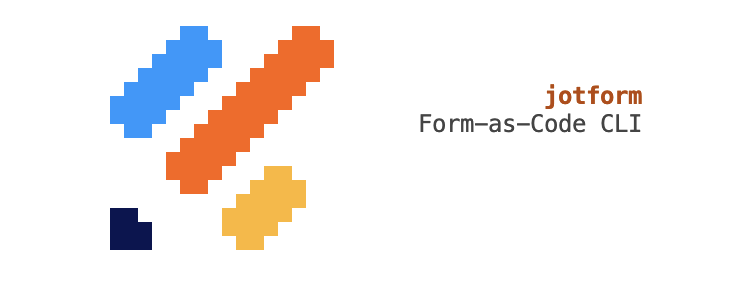
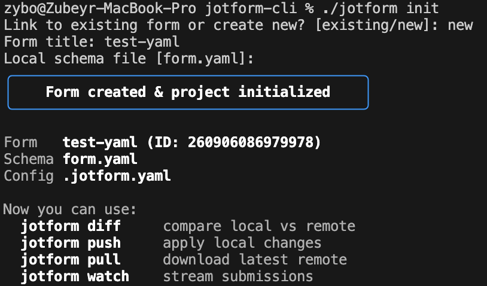
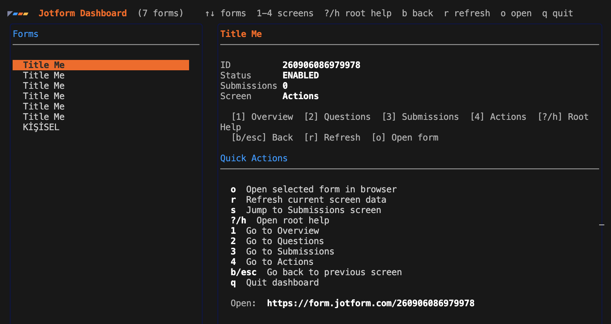
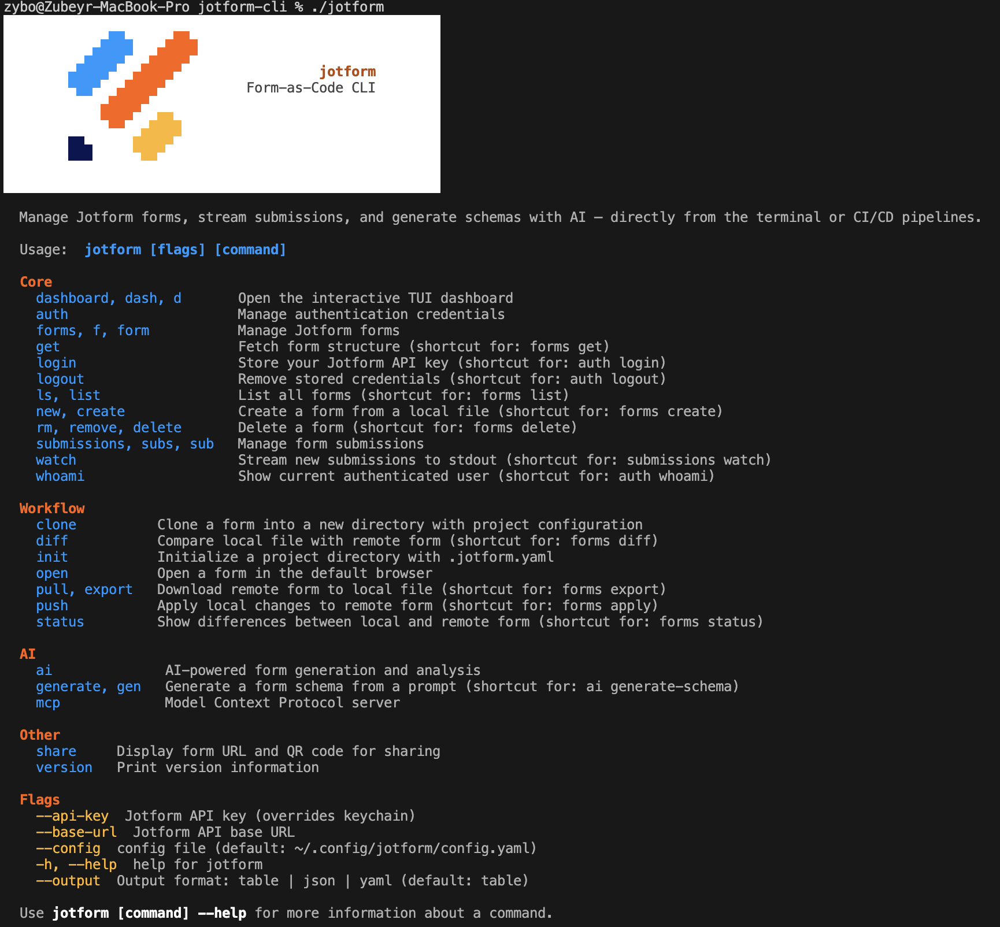

<p align="center">
	
</p>

# Jotform CLI

Form-as-Code CLI for creating, managing, and inspecting Jotform forms from the terminal.

## Why It Exists

Jotform CLI is built first as a tool surface for AI agents.

- Give AI agents a reliable, scriptable way to work with Jotform
- Enable universal agentic workflows across terminal, CI/CD, and MCP hosts
- Keep humans and agents on the same command surface with the same outputs
- Turn forms into something that can be created, inspected, diffed, and deployed like code

## What It Does

- **Auth**: Interactive TUI login with masked input, real-time API validation, and system keychain storage
- **Forms CRUD**: List, get, create, update, delete, diff, status, export, import, sync, and apply forms
- **Project context**: Initialize with `.jotform.yaml` for git-like workflows (`status`, `diff`, `push`, `pull`)
- **Dashboard**: Full-screen interactive TUI with split-pane form browser
- **Submissions**: List and stream submissions in real-time with checkpoint-based resumption
- **AI**: Generate form schemas from natural language prompts and get UX suggestions via Claude
- **MCP server**: Expose Jotform as native tools for Claude Desktop, Claude Code, and other MCP hosts
- **Share**: Display form URL with a terminal QR code
- **Branded UX**: Animated spinners, staggered list rendering, branded help with Jotform color palette

## Install

### Go install

```bash
go install github.com/zubeyralmaho/jotform-cli@latest
```

### Build from source

```bash
git clone https://github.com/zubeyralmaho/jotform-cli.git
cd jotform-cli
make build          # builds ./jotform
make install        # installs jotform + jf symlink to /usr/local/bin
```

## Quick Start

```bash
# 1. Login (interactive TUI with masked input)
jotform login

# 2. Browse your forms
jotform ls

# 3. Set up a project directory
jotform init                         # interactive: link existing or create new
jotform clone 242753193847060        # or clone directly into a new directory

# 4. Git-like workflow
jotform status                       # compare local vs remote
jotform diff                         # unified diff
jotform push                         # apply local changes to remote
jotform pull                         # download remote changes

# 5. AI-powered generation (requires ANTHROPIC_API_KEY)
jotform generate "contact form with name, email, and message"

# 6. Machine-readable output for scripting
jotform ls --output json
jotform get 242753193847060 --output yaml
```

## Screenshots

### Init Command

<p align="center">
  
</p>

### Dashboard Command

<p align="center">
  
</p>

### Share Command

<p align="center">
  
</p>

### Commands Help

<p align="center">
  
</p>

## Command Overview

### Core

| Command | Description |
|---|---|
| `jotform login` | Interactive TUI login (stores API key in system keychain) |
| `jotform logout` | Remove stored credentials |
| `jotform whoami` | Show current authenticated user |
| `jotform ls` | List all forms (animated table) |
| `jotform get [form-id]` | Fetch form structure |
| `jotform new --file <file>` | Create a form from JSON or YAML |
| `jotform rm [form-id]` | Delete a form |
| `jotform watch [form-id]` | Stream new submissions (newline-delimited JSON) |
| `jotform dashboard` | Full-screen interactive form browser |
| `jotform share [form-id]` | Display form URL and QR code |

### Workflow

| Command | Description |
|---|---|
| `jotform init` | Create `.jotform.yaml` project context |
| `jotform clone [form-id]` | Clone a form into a new directory |
| `jotform open [form-id]` | Open a form in the browser |
| `jotform status` | Show local vs remote differences |
| `jotform diff` | Unified diff between local and remote |
| `jotform push` | Apply local changes to remote |
| `jotform pull` | Download remote form to local file |

### AI and MCP

| Command | Description |
|---|---|
| `jotform generate "..."` | Generate a form schema from a prompt |
| `jotform ai analyze [form-id]` | Get AI suggestions for an existing form |
| `jotform mcp start-server` | Start the MCP server over stdio |

### Other

| Command | Description |
|---|---|
| `jotform version` | Print version, commit, and build date |
| `jotform completion [shell]` | Generate shell completion (bash, zsh, fish) |

### Grouped Commands

The shortcut commands above delegate to grouped subcommands that remain fully functional:

| Group | Subcommands |
|---|---|
| `jotform auth` | `login`, `logout`, `whoami` |
| `jotform forms` (alias: `f`, `form`) | `list`, `get`, `create`, `update`, `delete`, `sync`, `export`, `import`, `diff`, `apply`, `status` |
| `jotform submissions` (alias: `subs`, `sub`) | `list`, `watch` |
| `jotform ai` | `generate-schema`, `analyze` |
| `jotform mcp` | `start-server` |

## Shortcut Aliases

Every common operation has a short root-level alias:

| Shortcut | Equivalent | Other aliases |
|---|---|---|
| `jotform ls` | `forms list` | `list` |
| `jotform get` | `forms get` | |
| `jotform new` | `forms create` | `create` |
| `jotform rm` | `forms delete` | `remove`, `delete` |
| `jotform pull` | `forms export` | `export` |
| `jotform push` | `forms apply` | |
| `jotform diff` | `forms diff` | |
| `jotform status` | `forms status` | |
| `jotform watch` | `submissions watch` | |
| `jotform generate` | `ai generate-schema` | `gen` |
| `jotform login` | `auth login` | |
| `jotform logout` | `auth logout` | |
| `jotform whoami` | `auth whoami` | |

## Notable Flags

| Flag | Commands | Description |
|---|---|---|
| `--dry-run` | `update`, `rm`, `push` | Preview without executing |
| `--skip-validation` | `new`, `update`, `push` | Skip schema validation |
| `--force` / `-f` | `rm`, `clone` | Skip confirmation / overwrite directory |
| `--file` | `new`, `update`, `diff`, `push`, `status` | Path to local schema file |
| `--summary` | `status` | Show only change counts |
| `--out` / `-o` | `pull`, `generate` | Output file path |
| `--no-checkpoint` | `watch` | Disable checkpoint persistence (in-memory dedup only) |
| `--interval` | `watch` | Polling interval (default: 5s) |
| `--limit` | `submissions list` | Number of submissions to return |
| `--output` | *(global)* | `table`, `json`, `yaml` (default: table) |

## Configuration

Global flags:

```
--config    Path to config file (default: ~/.config/jotform/config.yaml)
--api-key   Jotform API key (overrides keychain)
--base-url  Jotform API base URL
--output    Output format: table | json | yaml
```

Environment variables (prefix `JOTFORM_`):

| Variable | Purpose |
|---|---|
| `JOTFORM_API_KEY` | Jotform API key |
| `JOTFORM_BASE_URL` | API base URL (default: `https://api.jotform.com`) |
| `ANTHROPIC_API_KEY` | Required for `ai` commands (generate-schema, analyze) |

## Project Context

`jotform init` creates a `.jotform.yaml` file in the current directory:

```yaml
form_id: "242753193847060"
name: "Contact Form"
schema: "form.yaml"
```

This enables context-aware commands that don't require repeating the form ID or file path:

```bash
jotform status    # reads form_id and schema from .jotform.yaml
jotform diff
jotform push
jotform pull
```

The CLI searches for `.jotform.yaml` starting from the current directory and walking up to parent directories (similar to `.git`).

## Shell Completion

```bash
# Bash
jotform completion bash > /etc/bash_completion.d/jotform

# Zsh
jotform completion zsh > "${fpath[1]}/_jotform"

# Fish
jotform completion fish > ~/.config/fish/completions/jotform.fish
```

## MCP Integration

Add to Claude Desktop config (`~/Library/Application Support/Claude/claude_desktop_config.json`):

```json
{
  "mcpServers": {
    "jotform": {
      "command": "jotform",
      "args": ["mcp", "start-server"],
      "env": {
        "JOTFORM_API_KEY": "your-api-key",
        "ANTHROPIC_API_KEY": "your-anthropic-key"
      }
    }
  }
}
```

Or for Claude Code (`.mcp.json` in project root):

```json
{
  "mcpServers": {
    "jotform": {
      "command": "jotform",
      "args": ["mcp", "start-server"],
      "env": {
        "JOTFORM_API_KEY": "your-api-key"
      }
    }
  }
}
```

## Development

```bash
make build          # compile with version info
make dev            # build without install (local ./jotform)
make test           # run tests with race detector + coverage
make lint           # go vet + golangci-lint
make install        # install jotform + jf to /usr/local/bin
make install-jf     # add jf symlink only
make clean          # remove binaries and coverage
```

```bash
go test ./...       # run all tests
go run . --help     # test without building
```

## Troubleshooting

**"form ID required"**: Run `jotform init` to create a project context, or pass the form ID as an argument.

**Keychain errors on Linux**: Ensure `gnome-keyring` or `kwallet` daemon is running. Alternatively, use `--api-key` flag or `JOTFORM_API_KEY` env var.

**"ANTHROPIC_API_KEY is required"**: Set `ANTHROPIC_API_KEY` via environment or config for `ai` commands.

**Machine-readable output**: Use `--output json` or `--output yaml` for scripting and CI pipelines.
